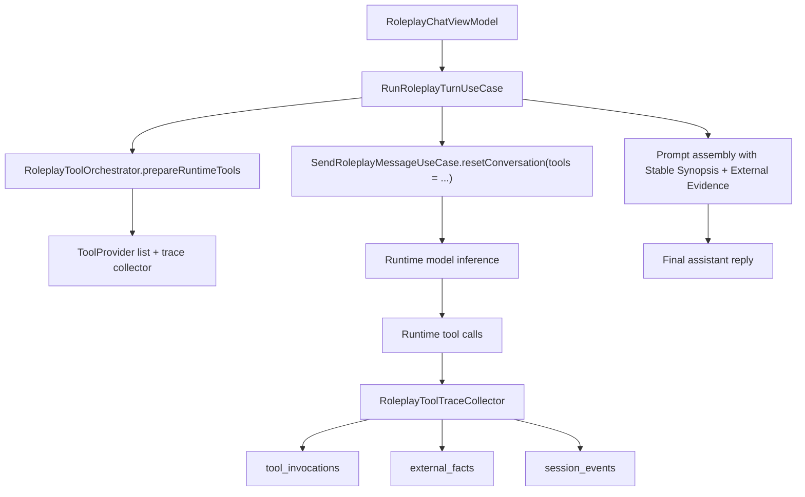

# Roleplay Tooling Architecture

This document defines how roleplay sessions use expandable tools without
degrading into host-side rule heuristics or contaminating long-term memory with
ephemeral real-world facts.

## Goals

- Keep roleplay chat as the primary product contract.
- Let the runtime model decide whether to call tools.
- Persist tool execution, external evidence, and audit logs separately.
- Prevent stale assistant claims from feeding back into retrieval and summary.
- Make new tools pluggable without rewriting the roleplay pipeline again.

## Non-goals

- Do not use keyword, regex, or intent-rule heuristics to trigger tools.
- Do not store raw tool traces as canonical chat messages.
- Do not let session summary become a recursive text dump of prior summaries.
- Do not treat transient device or web facts as long-term memory by default.

## Core principles

### 1. The model decides whether tools run

Roleplay tool invocation is agent-driven. The host registers available
`ToolProvider`s, enforces permissions and policy, and captures trace data, but
it does not decide when a tool should fire.

### 2. External evidence is a first-class state layer

Tool results are stored as structured `RoleplayExternalFact` records rather than
being flattened into assistant prose and then re-ingested later. Every fact can
carry:

- `factKey`
- `factType`
- `turnId`
- `toolInvocationId`
- `capturedAt`
- `freshnessTtlMillis`
- `confidence`
- `structuredValueJson`

This is the authoritative source for real-world facts inside a roleplay turn.

### 3. Canonical conversation, stable synopsis, and external evidence are separate

The roleplay stack now has three distinct state layers:

- `Canonical Conversation`
  The actual user and assistant utterances shown in chat.
- `Stable Synopsis`
  A bounded session synopsis used for continuity. It keeps durable
  relationship/story state and excludes tool-backed ephemeral turns by default.
- `External Evidence`
  Recent structured tool facts used for real-world grounding and re-checks.

These layers must not collapse into one another.

### 4. Retrieval must prefer user intent over stale assistant claims

Retrieval query construction now uses current user input plus recent user-side
context. It must not blindly reuse recent assistant factual claims, because a
bad claim can otherwise poison memory retrieval and keep reinforcing itself.

### 5. Tool traces are audit data, not prompt canon

Tool execution remains visible and debuggable through:

- `tool_invocations`
- `external_facts`
- `session_events`

These exist for observability, export, and optional UI trace rendering. They are
not canonical dialogue history.

## Implemented runtime flow

## Storage boundaries

### Canonical roleplay state

These continue to shape the main dialogue experience:

- session
- canonical messages
- runtime state
- open threads
- memory atoms
- memory items

### Stable continuity state

This is optimized for continuity, not raw completeness:

- session summary
- compaction cache

The stable synopsis excludes tool-backed ephemeral turns by default.

### External evidence state

This is optimized for real-world grounding:

- `external_facts`
- tool freshness metadata
- structured tool payloads

### Audit and debug state

This is optimized for investigation and export:

- `tool_invocations`
- tool lifecycle `session_events`
- debug export bundles

## Prompt contract

Prompt assembly now treats external evidence as its own dedicated section.

Important prompt rules:

- structured external evidence is more authoritative than older assistant prose
  about the real world,
- if evidence is stale, incomplete, or directly challenged by the user, the
  model should prefer calling a tool again,
- stable synopsis is for persistent continuity, not transient device facts.

## Summary contract

`SummarizeSessionUseCase` no longer recursively nests prior summaries. Instead,
it writes a bounded `Stable synopsis:` block from recent eligible messages.

Excluded by default:

- tool-backed assistant turns flagged with `excludeFromStableSynopsis`
- their linked user turns when those turns only exist to acquire ephemeral
  evidence

This prevents transient facts such as time, battery, or current location from
becoming sticky continuity state.

## Retrieval contract

`CompileRoleplayMemoryContextUseCase` now:

- builds memory queries from current user input plus recent user-side text,
- loads recent `external_facts` separately,
- budgets external evidence independently from summary and memory text.

This avoids the old failure mode where a wrong assistant claim became part of
the retrieval query and then kept reappearing as if it were verified truth.

## Tool contract requirements

Authoritative fact tools must return complete fields so the model does not need
to infer them. For example, `getDeviceSystemTime` now returns:

- Gregorian date
- localized weekday
- ISO weekday number
- lunar date
- 24-hour time
- hour and minute
- epoch milliseconds
- time zone

If the tool can answer a fact directly, the model should not derive that fact
from partial fields.

## Extension path

### 1. New tool families

New tools should plug into the existing runtime registration layer and emit:

- a runtime result payload,
- structured external facts when appropriate,
- tool lifecycle logs.

### 2. Freshness-aware UI and debugging

The chat debug trace and export bundle can expose evidence freshness, source,
and confidence without turning those records into user chat bubbles.

### 3. Higher-order evidence policies

Future work can add conflict detection, evidence supersession, and role/session
scoped evidence policies without changing the core storage model.

## Acceptance standard

A roleplay tool integration is only complete when all of the following are
true:

- the runtime model decides whether to invoke the tool,
- the tool result is persisted as audit data and structured evidence when
  needed,
- stable synopsis excludes ephemeral tool-backed turns by default,
- retrieval is not polluted by stale assistant claims,
- queue, stop, merge, regeneration, and export behavior still match roleplay
  expectations,
- provider failures degrade cleanly instead of leaving the session stuck.
