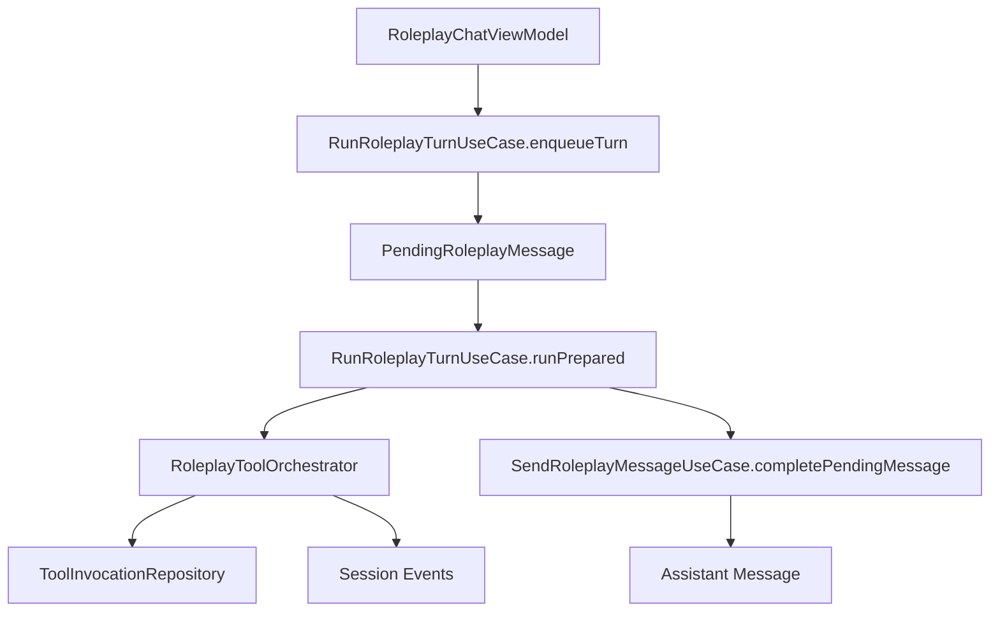

# Roleplay Tooling Architecture

This document defines how roleplay sessions can use expandable tools without
collapsing the existing roleplay runtime into a generic agent shell.

## Goals

- Keep roleplay conversation flow as the primary product contract.
- Add a turn-level orchestration layer that can decide when tools participate.
- Persist tool traces for audit and debugging without polluting roleplay memory.
- Make tool providers pluggable so future search, weather, map, and time tools
  can be added without rewriting the roleplay pipeline again.

## Non-goals

- Do not make raw tool requests and raw tool results first-class chat messages.
- Do not let tool providers bypass roleplay session state, queueing, or stop
  semantics.
- Do not bind the design to one provider technology such as LiteRT native
  function calling or the existing WebView skill runner.

## Core principles

### 1. Roleplay remains the source of truth

`RoleplayChatViewModel` keeps ownership of:

- queued user messages,
- delayed dispatch,
- merge-and-stop behavior,
- regeneration,
- UI error state.

Tools can participate in a turn, but they do not replace the roleplay turn
model.

### 2. Turn orchestration is a separate domain concern

`RunRoleplayTurnUseCase` is the roleplay turn entrypoint. It owns:

- enqueueing a staged turn,
- invoking a tool orchestrator before the final assistant reply,
- persisting tool traces,
- appending tool lifecycle events,
- falling back to the existing reply generation path when no tool chain handles
  the turn.

This keeps the old `SendRoleplayMessageUseCase` usable as the canonical reply
generator while moving orchestration concerns out of the ViewModel.

### 3. Tool traces are audit data, not prompt canon

Tool activity is stored in `tool_invocations` plus `session_events`.

It is intentionally not written into canonical roleplay messages, because the
memory and open-thread systems already consume user and assistant text. Mixing
raw tool traces into those channels would contaminate long-term memory with
ephemeral external facts.

### 4. Providers are adapters behind a stable domain model

The roleplay domain only depends on:

- `ToolInvocation`
- `ToolArtifactRef`
- `RoleplayToolOrchestrator`

Provider-specific mechanisms such as native function calling, JavaScript
skills, or future remote providers must sit behind adapter layers.

## Current foundation

The first architecture slice now exists in the app:

- `RunRoleplayTurnUseCase` is the roleplay turn orchestration entrypoint.
- `RoleplayToolOrchestrator` defines the orchestration boundary.
- `NoOpRoleplayToolOrchestrator` preserves current behavior while the provider
  layer is still empty.
- `ToolInvocationEntity`, `ToolInvocationDao`, and
  `RoomToolInvocationRepository` persist tool traces.
- `SessionEventType` now includes tool lifecycle events for log-driven
  debugging.

This means later tool execution work can be added without reworking the roleplay
send queue again.

## Runtime flow

## Storage boundaries

### Canonical roleplay data

These remain the sources that shape prompt assembly and long-term continuity:

- session
- canonical user messages
- canonical assistant messages
- summaries
- open threads
- memory atoms
- runtime state

### Tool audit data

These exist for execution traceability and later UI affordances:

- `tool_invocations`
- tool lifecycle `session_events`
- future tool artifacts such as web results, map payloads, or structured cards

## Extension path

### 1. Tool registry and policy

Add a registry that resolves which tools are available for a role and model.
Add policy gates so read-only tools can auto-run while device or write actions
require explicit confirmation.

### 2. Native tool adapter

Adapt LiteRT tool calling into the roleplay orchestration contract without
leaking provider types into roleplay domain models.

### 3. JavaScript skill adapter

Extract the existing WebView skill execution host into a reusable service that
roleplay tooling can call without depending on `AgentChatScreen`.

### 4. Result summarization contract

Every tool execution should emit at least:

- an audit payload,
- a user-visible trace summary,
- a model-facing summary.

These are separate products and should not reuse the same raw text.

### 5. Artifact rendering

Add optional UI rendering for structured tool artifacts such as map previews or
embedded web content. This should be additive and must not block plain-text
fallback.

## Acceptance standard

A roleplay tool integration is only complete when all of the following are
true:

- queueing, stop, merge, and regeneration semantics still match current
  roleplay behavior,
- tool traces are visible in logs and persistence,
- raw tool output does not enter memory extraction by default,
- turns still complete normally when no tools are available,
- provider failures degrade to a normal assistant reply or a controlled user
  error instead of leaving the session stuck.
